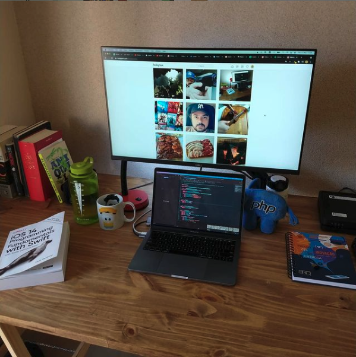

Hey there!

Checkout my social stuff [Instagram](http://instagram.com/toscanocombr) e [Twitter](http://twitter.com/toscanocombr) 

I'm Marcelo Toscano, I started as web developer in 1998 and worked mainly with PHP until 2019, since then I started new career in mobile development with Swift for iOS.

Currently working @ [BRQ Digital](http://brq.com) on the [Meu TIM](https://apps.apple.com/us/app/%CE%BCeu-tim/id668591218) app.

Apps I've also worked on 👨🏽‍💻

 [Meu TIM](https://apps.apple.com/us/app/%CE%BCeu-tim/id668591218)

Setup:

- Macbook Pro 2019 Quad Core i5 8GB 256GB NVMe
- Dell P2719H 27 inches display 
- Vivo Fibra 300Mb   
#setup #work #iOS #SwiftLang

### GitHub Stats

